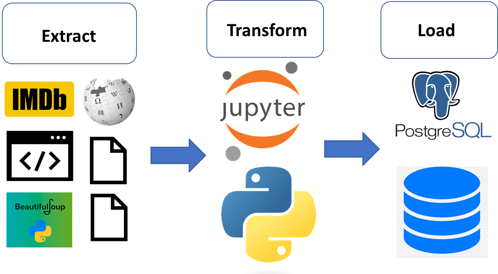
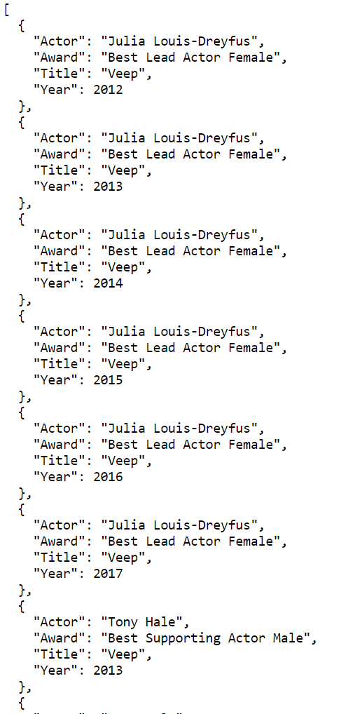

# ETL_IMDB

For this project we created relational database for top 250 IMDB TV series and  emmy awards for these series if any for the years 2010-2022.We used sql alchemy for object relational mapping and creating queries using Python. This was followed by creating app route using [flask](https://github.com/joshi-swetam/ETL_IMDB/blob/main/Load/SQLAlchemy%20and%20Flask/app.py)

   

## Extraction

- For the first source, IMDB <https://www.imdb.com/list/ls008957859/> was scraped to get the data for the title,rank,actors,synopsis, votes, rating etc. The full code for scraping can be found [here](https://github.com/joshi-swetam/ETL_IMDB/blob/main/Extraction/IMDB_Scrape.ipynb) and the resulting dataset can be located [here](https://github.com/joshi-swetam/ETL_IMDB/tree/extract/Extraction/Resources)
- In summary, the csv file was created by looping through all the titles based on the classes and getting the desired output by indexing. 

~~~ 
for each in title_list:
    try:
        
        titles = each.h3.a.get_text()
        title_link = each.h3.a['href'] 
        rank = each.h3.find('span', class_ = 'lister-item-index unbold text-primary').get_text().replace('.', '')
        run_years = each.h3.find('span',class_ = 'lister-item-year text-muted unbold').get_text()
        p_tag = each.find_all('p',class_ = 'text-muted text-small')
        certificate = p_tag[0].find('span', class_= "certificate").get_text().replace('TV-','')
        runtime = p_tag[0].find('span', class_= "runtime").get_text().replace('min','')
        genre = p_tag[0].find('span', class_= "genre").get_text().strip()
        Rating = each.find('span', class_ = 'ipl-rating-star__rating').get_text()
        Actor = p_tag[1].find_all('a')
        Actors = [actor.get_text() for actor in Actor]
        Votes = p_tag[2].find_all('span')[1].get_text().replace(',','')
        Synopsis = each.find_all('p')[1].get_text().strip()
    except :
        pass
    dict_elements = {'Title' : titles,
                    'url' : title_link,
                    'Rank' : rank,
                    'Years of running' : run_years,
                    'Certificate' : certificate,
                    'Run time in minutes' : runtime,
                    'Genre' : genre,
                    'Rating' : Rating,
                    'Actors' : Actors,
                    'Votes' : Votes,
                    'Synopsis' : Synopsis}                        
    # Add the dictionary to the list
    all_details_list.append(dict_elements) 
    print(dict_elements)
~~~
- Final dataframe looked like the image below

    
- For the csv files of the emmy award winners and nomination across various categories , we used Pandas function `pd.read_html` and got 7 files across the years 2010-2022 which can be loacted [here](https://github.com/joshi-swetam/ETL_IMDB/tree/extract/Extraction/Resources)

## Transformation
For the transformation following steps were followed: 
- Initial cleaning like stripping and replacing spaces,characters etc. was done while extracting. Further cleaning and transformation required next steps.
- Read data from extracted csv files from [Resources](https://github.com/joshi-swetam/ETL_IMDB/tree/transform/Transformation/Resources) folder.
- Initial csv files required dropping few columns, adding ids to tables, splitting columns to create new columns and finally creating relational database.
-  Because we did not have csv files with all the winners in the same csv, we had to combine them and assign ids based on the actors,categories etc. This was very challenging part for us to come up with the ways to create relations between the tables so that we can finally query our database.
- One such example is the code below for context.

~~~ actors = []
# get genres from imdb df
for index, row in imdb_top_250_df.iterrows():
    actors.extend(row['Actor/Actress'].strip().strip("").replace('[','').replace(']','').replace('\'', '').split(', '))

actors = pd.concat([pd.Series(actors)
                    , pd.Series(lead_actor_actress_df['Actor/Actress'])
                    , pd.Series(supporting_actor_actress_nominees_df['Actor/Actress'])
                    , pd.Series(winners_df['Lead Comedy Actor'])
                    , pd.Series(winners_df['Lead Drama Actor'])
                    , pd.Series(winners_df['Lead Comedy Actress'])
                    , pd.Series(winners_df['Lead Drama Actress'])]
                    , axis=0, ignore_index=True)
                

actors = actors.unique()
actors 
~~~

- Transformation also required merging dataframes to create the final database.
~~~ 
series_nominees_df = series_nominees_df.merge(titles_df, left_on='Titles', right_on='Titles', how='inner')
series_nominees_df = series_nominees_df.merge(network_df, left_on='Network', right_on='Network', how='inner')
series_nominees_df = series_nominees_df.merge(category_df, left_on='Category', right_on='Category', how='inner')

series_nominees_df = series_nominees_df[['Year','title_id','network_id','category_id','Producers','Result']]

series_award_id = award_df.loc[(award_df['award']=='Series')]['award_id']

series_nominees_df.insert(0, 'award_id', series_award_id)
series_nominees_df.insert(3, 'actor_id', np.NaN)
series_nominees_df.insert(6, 'role', np.NaN)
series_nominees_df.insert(7, 'episode', np.NaN)

series_nominees_df = series_nominees_df.rename(columns={ 'Year': 'year', 'Producers': 'producers', 'Result': 'winner'})

series_nominees_df['award_id'] = 1

series_nominees_df['winner'] = np.where(series_nominees_df['winner']=='Winner', True, False)

series_nominees_df.head() 
~~~ 

- Final step was to save the tranfsormed data to csv file in [output](https://github.com/joshi-swetam/ETL_IMDB/tree/transform/Transformation/output) folder

## Load
- For the loading part we started with creating Relational database diagram.
- https://www.quickdatabasediagrams.com/ was used to create [erd](erd) diagram 

- Imdb [schema](https://github.com/joshi-swetam/ETL_IMDB/blob/load/Load/schema.sql) was created using Postgresql and pgADMIN 4 
 - Basic queries such as select titles, rank and rating  and winners yearwise based on  the category from titles and top 250 tables were [performed](https://github.com/joshi-swetam/ETL_IMDB/blob/main/Load/Queries.sql) to check schema. For example below is the result for the query how many emmmy awards Breaking Bad won over 2010-2022 

 - For the final step in this project we used SQLAlchemy for object relational mapping and created datafreames for the resulting queries. The script for the same can be refered [here](https://github.com/joshi-swetam/ETL_IMDB/blob/main/Load/SQLAlchemy%20and%20Flask/sql_alchemy_query.ipynb)
 - [App routes](https://github.com/joshi-swetam/ETL_IMDB/blob/main/Load/SQLAlchemy%20and%20Flask/app.py)
 ~~~
  "/api/v1.0/<TV>"
  ~~~
  and 
  ~~~
  "/api/v1.0/<Actor>"
  ~~~
were created which willgive results in json for the TV show or actor provided in the url. 
for.eg below is the result for the show Veep 

